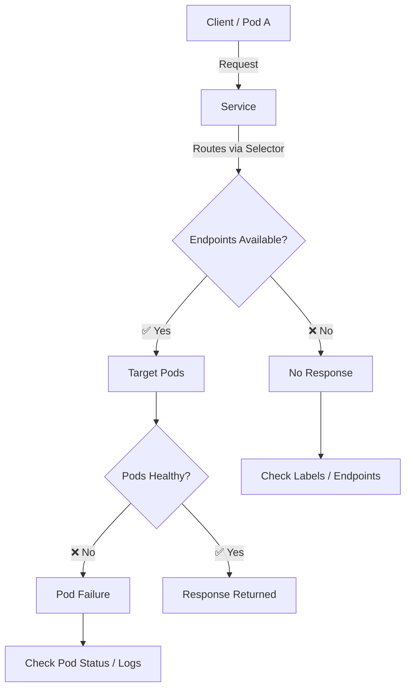
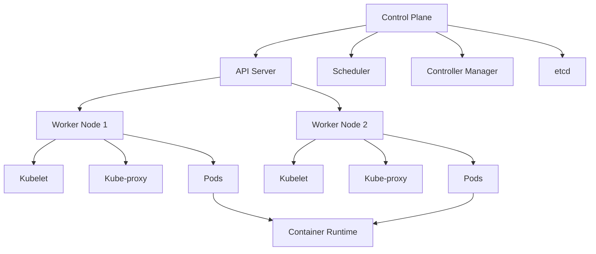

# 🚀 Kubernetes Real-Time Scenarios (Interview Guide)

A quick reference for common Kubernetes production issues with debugging steps and fixes.

---

## 🚨 Scenario 1: Pod in CrashLoopBackOff

**Q:** A pod keeps restarting and shows `CrashLoopBackOff`. What will you do?

### 🔍 Debug Steps

```bash
kubectl get pods
kubectl describe pod <pod-name>
kubectl logs <pod-name>
kubectl logs <pod-name> -c <container-name>
```

### ⚠️ Common Causes

* Wrong command/arguments
* Missing environment variables
* ConfigMap/Secret issues

### 🛠 Fix

```yaml
restartPolicy: Never
```

---

## 🚨 Scenario 2: Pod Stuck in Pending

**Q:** A pod is not starting and stuck in `Pending`. Why?

### ⚠️ Common Causes

* Insufficient CPU/Memory
* Node selector / taints mismatch
* PVC not bound

### 🔍 Debug

```bash
kubectl describe pod <pod-name>
```

### 📌 Typical Errors

* `0/5 nodes available: insufficient memory`
* `pod has unbound immediate PersistentVolumeClaims`

### 🛠 Fix

* Increase cluster capacity
* Adjust resource requests
* Fix StorageClass / create PV

---

## 🚨 Scenario 3: Service Not Accessible

**Q:** Pods are running but Service is not reachable.

### 🔍 Debug Steps

```bash
kubectl get svc
kubectl describe svc <service-name>
kubectl get pods --show-labels
kubectl get endpoints <service-name>
```

### ⚠️ Common Issue

* Selector mismatch → No endpoints

### 🧠 Example

```
app: web   ❌
app: web-app ✅
```

---

## 🚨 Scenario 4: App Works Inside Pod but Not Outside

**Q:** App responds inside pod but not externally.

### 🔍 Check

* Service Type:

  * `ClusterIP` → internal only
  * `NodePort` / `LoadBalancer` → external

### 🔍 Ingress Debug

```bash
kubectl get ingress
kubectl describe ingress <ingress-name>
```

### ⚠️ Common Issue

* DNS not mapped to Ingress hostname

---

## 🚨 Scenario 5: High CPU / Memory Usage (OOMKilled)

**Q:** Pods are getting `OOMKilled`.

### 🔍 Debug

```bash
kubectl describe pod <pod-name>
```

### 📌 Look For

* `Last State: Terminated`
* `Reason: OOMKilled`

### 🛠 Fix

* Increase memory limits
* Optimize application

---

## 🚨 Scenario 6: Rolling Update Causes Downtime

**Q:** During deployment update, users see downtime.

### 🔍 Check Strategy

```yaml
strategy:
  type: RollingUpdate
  rollingUpdate:
    maxUnavailable: 0
    maxSurge: 1
```

### 🛠 Fix

* Ensure `maxUnavailable: 0`
* Maintain extra pod during update

---

## 🚨 Scenario 7: ConfigMap Not Updated in Pods

**Q:** Updated ConfigMap but app still uses old config.

### ⚠️ Reason

* ConfigMaps are not hot-reloaded

### 🛠 Fix

```bash
kubectl rollout restart deployment <deployment-name>
```

---

## ✅ Quick Debug Flow (Interview Tip)

```
1. kubectl get pods
2. kubectl describe pod
3. kubectl logs
4. Check Service & Endpoints
5. Check Node / Resources / Storage
```

---

## ⭐ Pro Tips

* Always check **Events section** in `describe`
* Most issues come from:

  * Label mismatch
  * Resource limits
  * Storage problems
* Think in layers:

  * Pod → Service → Ingress → Node → Cluster

---


# 🚀 Kubernetes Application Failures: Complete Guide

A practical guide to common Kubernetes failures, reasons, and troubleshooting steps used in real-world production.

---

## 🔴 1. Pod-Level Failures

### Common Issues

* **CrashLoopBackOff** → Application crash, missing ENV variables
* **Pending** → No nodes, insufficient CPU/memory, PVC issues
* **ImagePullBackOff** → Wrong image name, tag, or registry access

### 🔍 Troubleshooting

```bash
kubectl get pods
kubectl describe pod <pod-name>
kubectl logs <pod-name>
```

---

## 🟠 2. ConfigMap & Environment Variable Errors

### Reasons

* Wrong key names
* Incorrect mount paths
* Missing ConfigMaps or Secrets

### 🛠 Fix

```bash
kubectl describe cm <name>
```

* Verify mounted files inside the pod
* Restart pods after config changes

---

## 🟡 3. Resource Failures

### Common Problems

* **OOMKilled (Out of Memory)**
* CPU throttling

### 🛠 Solution

* Increase memory/CPU limits
* Optimize application resource usage

```bash
kubectl top pod
```

---

## 🔵 4. Networking Issues

### Failures

* Service not reachable
* No endpoints
* Ingress misconfiguration

### 🔍 Checks

```bash
kubectl get svc
kubectl get endpoints
```

* Verify labels, ports, and ingress rules

---

## 🟣 5. Storage Failures

### Issues

* PVC not bound
* StorageClass missing
* Volume mount errors

### 🔍 Troubleshooting

```bash
kubectl describe pvc
```

* Verify StorageClass and access modes

---

## 🔴 6. Node & Cluster Issues

### Reasons

* Node NotReady
* Disk or memory pressure
* Kubelet issues

### 🛠 Fix

```bash
kubectl describe node
```

* Check node resource usage

---

## 🟠 7. Security & Policy Failures

### Problems

* RBAC permission denied
* NetworkPolicy blocking traffic

### 🔍 Checks

* RoleBindings & ServiceAccounts
* NetworkPolicy rules

---

## ⭐ Golden Troubleshooting Steps (Always Follow This Order)

```text
1. kubectl get pods
2. kubectl describe pod <pod-name>
3. kubectl logs <pod-name>
4. Check ConfigMaps & Secrets
5. Verify Services & Ingress
6. Check Node & Resources
7. Review Events & Logs
```

---

## ✅ Key Takeaway

* Most Kubernetes failures are **misconfigurations**, not bugs
* Strong troubleshooting skills = **faster recovery + stable systems**

---

## 📌 Tags

#Kubernetes #DevOps #CloudComputing #Containerization
#K8s #SRE #DevOpsEngineering #CloudNative
#KubernetesTroubleshooting #CKA #CKAD #Microservices

---

# 🚀 Kubernetes Commands You Actually Use Daily

A practical cheat sheet of kubectl commands used in real-world DevOps work.

---

## 🔍 Debugging & Monitoring (Most Used)

```bash
kubectl get pods -o wide
kubectl describe pod <pod-name>
kubectl logs <pod-name>
kubectl logs -f <pod-name>
kubectl top pods
kubectl get events
```

👉 These are your **first steps during any issue**

---

## ⚙️ Working with Pods

```bash
kubectl exec -it <pod-name> -- /bin/sh
kubectl delete pod <pod-name>
kubectl cp <pod-name>:<path> <local-path>
```

👉 Used for **troubleshooting & quick fixes**

---

## 🚀 Deployments & Scaling

```bash
kubectl get deployments
kubectl describe deployment <name>
kubectl scale deployment <name> --replicas=3
kubectl rollout status deployment <name>
kubectl rollout restart deployment <name>
```

👉 Daily work for **releases & scaling**

---

## 🌐 Services & Networking

```bash
kubectl get svc
kubectl describe svc <name>
kubectl port-forward svc/<name> 8080:80
```

👉 Useful for **local debugging & access**

---

## 📦 Config & Resources

```bash
kubectl apply -f <file>
kubectl delete -f <file>
kubectl edit <resource>
kubectl get all
```

👉 Used in almost **every deployment**

---

## 🔐 Namespaces & Context

```bash
kubectl get ns
kubectl config get-contexts
kubectl config use-context <name>
kubectl config set-context --current --namespace=<ns>
```

👉 Avoid deploying to **wrong environment 😅**

---

## ⚡ Golden Rule

> Kubernetes is not about commands...
> It's about how fast you can **debug, fix, and deploy**

---

## 📌 Pro Tips

* Always start with:

  ```
  kubectl get pods → describe → logs
  ```
* Use `-o wide` for more details
* Use `-f` (follow) for real-time logs
* Prefer `rollout restart` instead of deleting pods manually

---

## 📌 Tags

#Kubernetes #DevOps #K8s #CloudComputing
#Kubectl #SRE #CloudNative #PlatformEngineering

---

# 🚨 Kubernetes Service Not Reachable? Debugging Guide

This is one of the most common issues DevOps engineers face in Kubernetes.

- Pod is running ✅  
- Service exists ✅  
- But still... no response ❌  

Before you panic, follow this simple debugging checklist 👇

---

## 🧭 Architecture Flow (Diagram)



---

## 🔍 Step-by-step Troubleshooting

### ✅ 1. Check if Service exists
```bash
kubectl get svc
```

### ✅ 2. Verify Service configuration
```bash
kubectl describe svc <service-name>
```

### ✅ 3. Confirm Pods are running
```bash
kubectl get pods -l app=<label>
```

### ✅ 4. Check Endpoints
```bash
kubectl get endpoints <service-name>
```

👉 If endpoints are empty → your Service is NOT linked to Pods.

### ✅ 5. Test DNS resolution
```bash
nslookup <service-name>
```

### ✅ 6. Test connectivity from another Pod
```bash
kubectl exec -it <pod-name> -- curl <service-name>:<port>
```

---

## 💡 Most Common Root Causes

❌ Wrong selector labels  
❌ Pods not running  
❌ Port mismatch (Service vs Container)  
❌ Network Policies blocking traffic  

---

## 🔥 Pro Tip

👉 80% of the time, the issue is:

**Label mismatch OR no endpoints**

Always check:
- Selectors
- Endpoints  

➡️ This saves a lot of debugging time.

---

## 🏷️ Tags
`Kubernetes` `DevOps` `K8s` `Troubleshooting` `CloudNative` `PlatformEngineering`


# 🚀 Kubernetes Fundamentals Cheat Sheet

If you're working in DevOps, Cloud, or Platform Engineering, understanding Kubernetes is essential.

Here’s a simplified breakdown of core Kubernetes concepts every engineer should know 👇

---

## 🧭 Kubernetes Architecture Diagram



---

## 📌 Core Concepts

### 🔹 1. Architecture
- Control Plane → Brain of the cluster  
- Worker Nodes → Where applications run  

---

### 🔹 2. Control Plane Components
- API Server → Entry point  
- etcd → Stores cluster state  
- Scheduler → Assigns Pods  
- Controller Manager → Maintains desired state  

---

### 🔹 3. Worker Node Components
- Kubelet → Communicates with control plane  
- Kube-proxy → Handles networking  
- Container Runtime → Runs containers  

---

### 🔹 4. Pod (Smallest Unit)
- A Pod = one or more containers  
- Shares network, storage, namespace  

---

### 🔹 5. Deployments & ReplicaSets
- Declarative app management  
- Maintains desired number of Pods  
- Supports rolling updates  

---

### 🔹 6. StatefulSets
- Used for stateful apps (DBs)  
- Stable identity + persistent storage  

---

### 🔹 7. Jobs & CronJobs
- Jobs → Run once  
- CronJobs → Run on schedule  

---

### 🔹 8. DaemonSets
- Runs one Pod per node  
- Used for logging, monitoring agents  

---

### 🔹 9. Services (Internal Communication)
- Stable IP / DNS for Pods  
- Load balancing inside cluster  

---

### 🔹 10. Service Types
- ClusterIP → Internal access  
- NodePort → Exposed via node  
- LoadBalancer → External access (cloud)  

---

### 🔹 11. Ingress
- Manages external HTTP/HTTPS routing  
- Supports domain & path-based routing  

---

### 🔹 12. Persistent Storage (PV & PVC)
- PV → Actual storage  
- PVC → Request for storage  

---

### 🔹 13. ConfigMaps & Secrets
- ConfigMaps → Non-sensitive config  
- Secrets → Sensitive data (encoded)  

---

### 🔹 14. Horizontal Pod Autoscaler (HPA)
- Automatically scales Pods  
- Based on CPU / Memory  

---

### 🔹 15. Health Checks
- Liveness Probe → Restart if unhealthy  
- Readiness Probe → Controls traffic  

---

## 🔥 Key Takeaway

👉 Kubernetes follows a **declarative model**

You define the desired state, and Kubernetes continuously works to match it.

---

## 🏷️ Tags
`Kubernetes` `DevOps` `Cloud` `K8s` `PlatformEngineering` `Containers`
